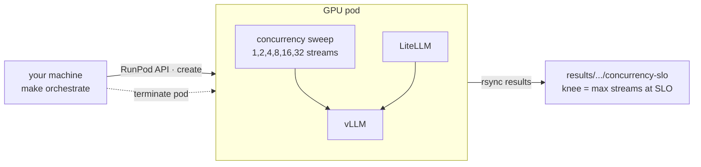
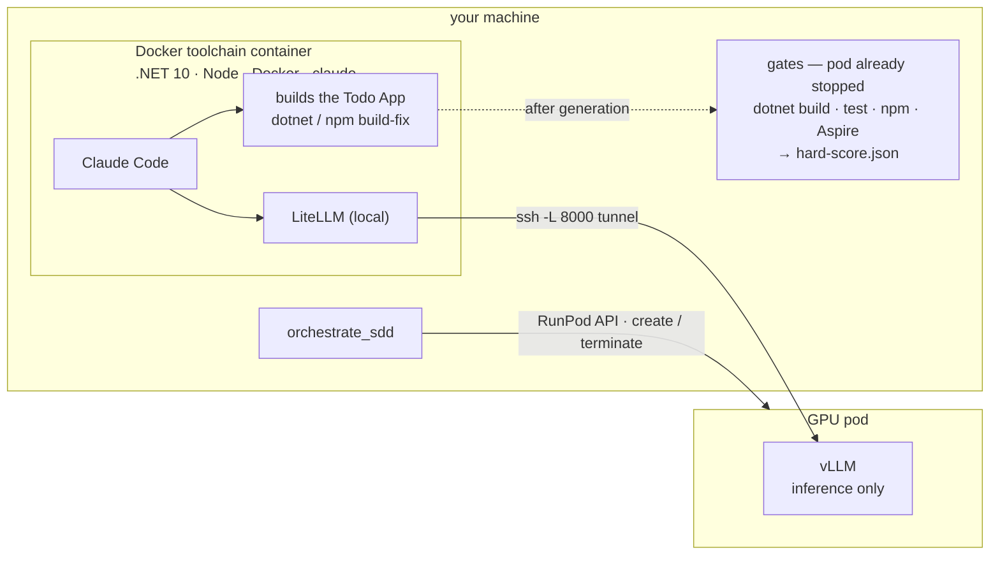

# Developer AI Lab

A reproducible lab for evaluating AI models across the **whole software development
lifecycle** — not just code generation, and not just tokens/second. It measures real
engineering productivity and the **hardware needed to support a development team** when
self-hosting models.

## What it answers

- Which model develops better software, and follows an SDD process best?
- How many concurrent developers can one self-hosted model support on given hardware?
- What is the optimal hardware for a model and a team size?
- When does self-hosting make sense versus commercial APIs?

## Principle: the GPU pod runs inference only

The expensive resource is the GPU, and it is needed **only for model inference**.
Everything else — the agent, builds, tests, load generation, scoring — runs off the GPU.
Models are driven through the agent we actually use, kept model-independent:

```
Claude Code (headless)  ->  LiteLLM (Anthropic API)  ->  vLLM (OpenAI API)  ->  model
```

Swapping models is a config change (`configs/<model>.yaml`; the LiteLLM upstream via
`LITELLM_UPSTREAM_MODEL` / `VLLM_BASE`) — never new code. Works for Qwen, GLM, MiniMax, etc.

## Two benchmarks

### 1. Concurrency & capacity — `make orchestrate`

*"How many developers can one model serve on this hardware?"* A load test streams
concurrent requests at vLLM, measures per-stream **TTFT** and **decode throughput**, and
finds the highest concurrency that still holds an SLO (the **knee**). This is pure
inference load, so it runs on the pod.



### 2. SDD lifecycle — `make sdd-run`  (agent local, pod = inference only)

*"Which model builds better software, end to end?"* An agent builds a real Todo App
through the full Spec-Driven-Development flow, scored by deterministic gates. The **agent,
its build-fix loop, and the gates all run locally** in a Docker toolchain container; the
pod serves vLLM only, reached over an SSH tunnel. The pod stops the moment generation
ends — you pay GPU only while the model is actually generating.



SDD phases — one Claude Code session per phase, shared workspace:

```
spec -> acceptance -> architecture -> plan -> backend -> frontend -> Aspire -> tests -> review
```

Scoring has two layers: a deterministic **hard score** (build / test / Aspire / frontend
gates + SDD artifact presence) now; a pinned-LLM **soft score** (architecture & code
quality) is planned.

## Running

One-time local setup:

```bash
cp .env.example .env            # RUNPOD_API_KEY + SSH_KEY_PATH (a passphrase-less key)
pip install -r requirements-orchestrator.txt
```

**Concurrency benchmark** (everything on the pod):

```bash
make orchestrate CONFIG=configs/qwen3coder.yaml
```

**SDD benchmark** (agent local). Also needs Docker and the toolchain image:

```bash
docker build -t dail-toolchain -f infra/toolchain/Dockerfile .    # once
make sdd-run CONFIG=configs/qwen3coder.yaml
```

Both create the pod, run, pull results to `results/<timestamp>/` (gitignored), and
**terminate the pod** so per-second billing stops. The pod has no git credentials —
nothing is pushed from it. You can re-score a produced SDD workspace anytime, with no pod:

```bash
make gates WORKSPACE=results/<run>/sdd/workspace
```

## RunPod & costs

> ⚠️ **Every benchmark run provisions real, paid GPU hardware.** Each `make orchestrate` /
> `make sdd-run` creates an on-demand GPU pod on [RunPod](https://www.runpod.io), runs, and
> terminates it. You are billed **per second** for as long as the pod exists.

### Prerequisites

1. A RunPod account with **credit loaded** — pods won't start otherwise.
2. A RunPod **API key** (console → Settings → API Keys).
3. A **passphrase-less SSH key** — its public half is injected into the pod at boot and the
   orchestrator reaches the pod over SSH.

Put both in `.env` (gitignored):

```bash
cp .env.example .env
# RUNPOD_API_KEY=...
# SSH_KEY_PATH=~/.ssh/runpod_key      # the PRIVATE key; <path>.pub must exist
```

Which GPU and pod image are used is declared in `infra/runpod/pod.yaml` — `gpu_type_ids` are
tried in order until one has capacity (currently `NVIDIA L40S`, then `A100 80GB PCIe`).

### What you pay for, and the safety net

You pay GPU **only while the pod exists**, which the orchestrators keep as short as possible
— the SDD pod is terminated the moment generation ends (gates then run locally, pod down).
Three layers guard against runaway spend:

- The pod is terminated on **every** exit path — success, error, Ctrl-C, even `SIGTERM`.
- A **watchdog** kills the pod if vLLM stalls on startup, generation hangs, or a wall-clock
  ceiling is hit, and reaps pods orphaned by a crashed run on the next start.
- **`make reap`** is a panic button that terminates **all** your pods via the API, any time:

```bash
make reap
```

If you ever interrupt a run in a way that skips cleanup, run `make reap` and/or check the
RunPod console — a forgotten pod bills until it is terminated.

### Observed costs

Real costs from our own runs. A run = create → serve/generate → terminate; cost ≈ the GPU's
$/hr times how long the pod is up (model download + load + the actual benchmark). We'll
extend this table as we test more models and hardware:

| Model | Hardware | Benchmark | Approx. cost |
|---|---|---|---|
| Qwen3-Coder-30B-A3B-FP8 | 1× NVIDIA L40S | SDD (todo-app) | ~$0.40 |

## Layout

- `configs/` — per-model vLLM serving configs (the only per-model change).
- `scripts/` — runners + orchestrators (`orchestrate_pod.py`, `orchestrate_sdd.py`);
  `scripts/lib/` is tested pure logic (slo, hardware, gates, command builders, …).
- `benchmarks/scenarios/todo-app/` — the SDD scenario (per-phase prompts + gate defs).
- `infra/litellm/` — the Anthropic↔OpenAI proxy. `infra/runpod/` — pod spec.
  `infra/toolchain/` — the local SDD toolchain image.
- `docs/` — goals, methodology, results.

`make test` runs the unit suite. See `docs/` for goals and methodology.
