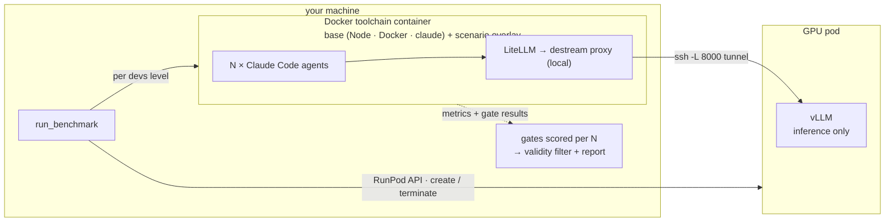

# Developer AI Lab

[](https://github.com/dpoblacion/developer-ai-lab/actions/workflows/ci.yml)
[](LICENSE)


A reproducible harness that answers: **given a model family + N developers, which self-hosted
hardware serves them at SLO and at what $/dev?** — a hardware-sizing tool for self-hosting
coding-assistant models. See `docs/methodology.md` for the full framing, and
[`docs/results.md`](docs/results.md) for how results are produced and visualized.

**▶ Live demo:** [developer-ai-lab.streamlit.app](https://developer-ai-lab.streamlit.app/) —
the dashboard over this repo's committed results, no setup needed.

<!-- TODO(demo): add a dashboard screenshot here -->

> ⚠️ Benchmark runs provision **real, paid GPU pods** on RunPod, billed per second
> (a typical validated run costs $0.10–$1). Everything else — tests, dashboard,
> configuration — is free and offline. [Details below.](#runpod--costs)

## What it answers

- For a given model and team size N, which hardware serves N concurrent developers within SLO?
- What is the $/dev-month for self-hosting on each hardware option?
- How does $/dev change with team size, and where does each GPU stop holding the SLO?

## Principle: the GPU pod runs inference only

The expensive resource is the GPU, and it is needed **only for model inference**.
Everything else — the agent, builds, tests, load generation, scoring — runs off the GPU.
Models are driven through the agent we actually use, kept model-independent:

```
Claude Code (headless)  ->  LiteLLM (Anthropic API)  ->  destream proxy  ->  vLLM (OpenAI API)  ->  model
```

The **destream proxy** (`scripts/destream_proxy.py`) sits between LiteLLM and vLLM because
vLLM's qwen3 streaming tool-call parser is buggy (tool calls leak into message content); the
proxy forces the upstream call to be non-streaming and re-emits the reply as SSE chunks.

Swapping models is a config change (`configs/models/<family>-<quant>.yaml` + `configs/hardware/<hw>.yaml`;
the LiteLLM upstream via `LITELLM_UPSTREAM_MODEL` / `VLLM_BASE`) — never new code. Works for
Qwen, GLM, MiniMax, etc.

## Benchmarks

The lab runs a **benchmark** with a chosen **model** on a **hardware** config. A benchmark is a
self-contained folder under `benchmarks/<name>/` that defines the **team sizes** to test (`devs`),
the task and its prompts, and the validity gates — the **model family** and the **hardware** are
the run axes you vary:

```bash
make run BENCHMARK=<benchmark> MODEL=<family> HARDWARE=<hardware>
```

Two benchmarks ship built-in:

- **`dev-load`** — the **capacity** benchmark. N agents concurrently build the same small
  TypeScript module; each N in the `devs` list is run directly (holds SLO? + $/dev at that N).
  Team sizes: `[4, 8]` (edit `scenario.yaml` to add more). Pick the model with `MODEL=<family>`.
- **`smoke`** — stack pre-flight (`make validate`). A single-agent minimal task to confirm
  the serving + agent + gate stack works before a full capacity run.

### How a benchmark run works

The run chooses a **model family** (`MODEL=<family>`, e.g. `qwen3-coder`). The **variant** (quant) is
resolved per hardware: the hardware config declares `supported_quants` (e.g. `[fp8, awq, bf16]`),
and `compose.py` picks the model file that matches the first supported quant
(`configs/models/<family>-<quant>.yaml`). This means the chosen model targets the right
quantization automatically on each GPU without manual overrides.

Each N in the benchmark's `devs` list is tested **directly** — N agents run in parallel,
metrics are collected from `/metrics`, and gates are scored. The output per N is:
`holds_slo` (bool), `cost_per_dev_month`, `median_tps`, `median_ttft`, `valid`, `tokens_per_dev`.



**Gates are a minimum-validity filter**, not a quality score. They confirm each agent did
real work (so the performance and token numbers are trustworthy) but do not rank model quality —
that is out of scope for this hardware-sizing question.

## Running

**Local requirements:** macOS or Linux, Python **3.11+**, Docker (daemon running), `ssh`
and `rsync`. Plus a [RunPod](https://www.runpod.io) account with credit — every `make run`
creates a real, per-second-billed GPU pod (see [RunPod & costs](#runpod--costs)).

One-time local setup:

```bash
cp .env.example .env            # RUNPOD_API_KEY + SSH_KEY_PATH (passphrase-less); optional HF_TOKEN
pip install -r requirements-orchestrator.txt
```

Build the base toolchain image (needed once):

```bash
docker build -t dail-toolchain -f infra/toolchain/Dockerfile .
```

Run the capacity benchmark with a model on a specific hardware:

```bash
make run BENCHMARK=dev-load MODEL=qwen3-coder HARDWARE=l40s
make run BENCHMARK=dev-load MODEL=glm-5.2 HARDWARE=h200 GPUS=8   # GLM-5.2 on 8× H200
```

Validate the stack first (cheap, ~1 short agent):

```bash
make validate HARDWARE=l40s
```

Both create the pod, run, pull results to `results/` (gitignored, config-keyed — see below), and
**terminate the pod** so per-second billing stops.

### Reading results

Runs are laid out **benchmark-first**, so the tree mirrors benchmark → model → hardware:

```
results/<benchmark>/<family>-<quant>/<hardware>-<gpus>gpu/<run_id>/
  report.json               # flat by_devs summary (kept)
  artifacts/n<N>/agent<i>/  # per-agent workspace + transcripts (heavy)
```

`report.json` has a flat `by_devs` structure: one entry per N with `holds_slo`,
`cost_per_dev_month`, `median_tps`, `median_ttft`, `valid`, `tokens_per_dev`, plus a `timeline`
and `pod_cost_usd` (measured pod wall-clock × the hardware's list $/GPU-hr). The latest run per
config+benchmark is the lexically-max `<run_id>`.

```bash
make dashboard          # benchmark → N → model×hardware viewer (Streamlit + Plotly)
make prune-artifacts    # drop artifacts/ of all but the latest run per config (keeps every report.json)
```

The dashboard lists benchmarks, then for a chosen team size compares every **model×hardware**
combo ranked by $/dev (cheapest that holds SLO wins), with per-run detail (timeline, token
totals, gate outcomes). The `smoke` pre-flight is hidden. The small `report.json` files **are
committed** — they feed the hosted demo at
[developer-ai-lab.streamlit.app](https://developer-ai-lab.streamlit.app/) (`.gitignore`
whitelists them); the heavy `artifacts/` stay gitignored. The dashboard reads
`results/**/report.json`.

`BENCHMARK` accepts a **bare name** as a shortcut: `make run BENCHMARK=dev-load` is the same
as `BENCHMARK=benchmarks/dev-load/scenario.yaml`. `MODEL` defaults to `qwen3-coder`; `HARDWARE`
defaults to `l40s`; `GPUS` defaults to `1`; `KEEP=1` leaves the pod running for debugging.
`QUANT=<quant>` forces the model variant instead of the hardware's preference order — the
knob that makes same-hardware quantization pairs measurable (e.g. `QUANT=awq` on an
fp8-first GPU); an unservable combination refuses to launch.

## Configuration

A run is composed from three independent, reusable axes — **benchmark(task+N) × model × hardware** —
that `scripts/lib/compose.py` merges into the flat config the pod consumes (written to
`configs/_composed.yaml`, rsync'd to the pod). The **model** (`MODEL=`) and **hardware**
(`HARDWARE=`) are chosen at run time; the benchmark carries the task + `devs`. Precedence for any
shared key is `constants < model < hardware < benchmark.serving`. Adding a model, a GPU, or a
benchmark is a new YAML file — never new code.

### Model — `configs/models/*.yaml` (one file per model **variant**)

The portable serving recipe for one model variant. Resolution is by the **`family` and `quant`
fields inside the file** (matched against the hardware's `supported_quants`), not by the
filename — so any `*.yaml` works; naming it `<family>-<quant>.yaml` is just a convention (the
shipped `qwen3-coder-fp8.yaml` / `qwen3-coder-awq.yaml` declare `family: qwen3-coder` with
`quant: fp8` / `awq`). Required: `family`,
`quant`, `model`, `served_model_name`, `vllm_version`, `image`, `container_disk_gb`.

| Field | Required | What it is |
|---|---|---|
| `family` | yes | Model family name (selected at run time via `--model` / Make `MODEL=`; matched against `configs/models/*.yaml`) |
| `quant` | yes | Quantization variant (e.g. `fp8`, `awq`, `bf16`); matched against hardware `supported_quants` |
| `model` | yes | Hugging Face repo id served by vLLM |
| `served_model_name` | yes | Short name vLLM/LiteLLM expose (and the pod label) |
| `vllm_version` | yes | Pinned vLLM version (must match the `image`'s torch/CUDA) |
| `image` | yes | RunPod base image; its torch/CUDA must satisfy `vllm_version` |
| `container_disk_gb` | yes | Pod container disk (large enough for the weights) |
| `pip_constraints` | no | Extra pip constraints (e.g. `["transformers<5"]`) |
| `tool_call_parser` | no | vLLM tool-call parser (e.g. `qwen3_xml`, `glm47`) |
| `reasoning_parser` | no | vLLM reasoning parser (e.g. `glm45`) |
| `enable_auto_tool_choice` | no | Enable vLLM auto tool choice |
| `kv_cache_dtype` | no | e.g. `fp8` |
| `extra_args` | no | Raw extra vLLM CLI args (list) |
| `env` | no | Env vars exported before vLLM starts |

`tensor_parallel_size` is **not** here — it is derived from the GPU count (`--gpus`).

### Hardware — `configs/hardware/<hw>.yaml`

One GPU **type**, priced **per GPU**. The GPU **count** is the run's `--gpus N` (Make
`GPUS=N`), not a field here.

| Field | What it is |
|---|---|
| `gpu_type_ids` | One-element list with the exact RunPod GPU id (e.g. `["NVIDIA L40S"]`) |
| `price_usd_per_gpu_hour` | Per-GPU on-demand price (total = price × `--gpus`) |
| `gpu_memory_utilization` | vLLM `--gpu-memory-utilization` for this GPU |
| `supported_quants` | Ordered list of quant variants this GPU supports (e.g. `[fp8, awq, bf16]`); `compose.py` picks the first that matches a model file |
| `provider` / `instance` | Informational annotation (exported to the pod env as `HW_PROVIDER` / `HW_INSTANCE`) |

### Benchmark — `benchmarks/<name>/scenario.yaml`

A self-contained benchmark package — the **task**, not the model (the model is `MODEL=` at run
time). `serving:` overrides the workload knobs for that run; `max_num_seqs` is **derived** by
`compose.py` from `max(devs)` — do not set it manually.

| Field | What it is |
|---|---|
| `name` / `description` | Benchmark identity |
| `devs` | List of team sizes to test (e.g. `[4, 8]`); each N is run directly |
| `slo.max_ttft` | Max acceptable median time-to-first-token per stream (s) |
| `slo.min_tps` | Min acceptable median per-stream decode throughput (tok/s) |
| `serving.max_model_len` | vLLM context window for this run |
| `task.phases` | Ordered list of headless Claude Code sessions: `id`, `title`, `prompt`, `allowed_tools`, `max_turns` |
| `task.gates` | Validity filter: `id`, `description`, `cmd` (shell at workspace root), `expect_exit` |

## RunPod & costs

> ⚠️ **Every benchmark run provisions real, paid GPU hardware.** Each `make run` creates an on-demand GPU pod on [RunPod](https://www.runpod.io), runs, and
> terminates it. You are billed **per second** for as long as the pod exists.

### Prerequisites

1. A RunPod account with **credit loaded** — pods won't start otherwise.
2. A RunPod **API key** (console → Settings → API Keys).
3. A **passphrase-less SSH key** — its public half is injected into the pod at boot and the
   orchestrator reaches the pod over SSH.

Put both in `.env` (gitignored):

```bash
cp .env.example .env
# RUNPOD_API_KEY=...
# SSH_KEY_PATH=~/.ssh/runpod_key      # the PRIVATE key; <path>.pub must exist
# HF_TOKEN=hf_...                     # optional: free HF read token; see note below
```

A free **`HF_TOKEN`** (huggingface.co/settings/tokens) is optional but recommended: the pod
downloads model weights from the Hugging Face Hub, and anonymous downloads share a low
per-IP rate limit (3k resolver requests / 5 min) that **429-stalls** partway through a large
model. A token raises it to 5k/5 min per-account. `start_vllm.sh` picks it up from `.env`.

Which GPU **type** is used is declared in `configs/hardware/<hw>.yaml` (`gpu_type_ids`); the GPU
**count** is the run's `--gpus N` (Make: `GPUS=N`, default 1). Each hardware config is a single
type — if it has no capacity the run fails, so pick another hardware config.

### What you pay for, and the safety net

You pay GPU **only while the pod exists**, which the orchestrators keep as short as possible.
Three layers guard against runaway spend:

- The pod is terminated on **every** exit path — success, error, Ctrl-C, even `SIGTERM`.
- A **watchdog** kills the pod if vLLM stalls on startup, generation hangs, or a wall-clock
  ceiling is hit, and reaps pods orphaned by a crashed run on the next start.
- **`make reap`** is a panic button that terminates **all** your pods via the API, any time:

```bash
make reap
```

If you ever interrupt a run in a way that skips cleanup, run `make reap` and/or check the
RunPod console — a forgotten pod bills until it is terminated.

### Observed costs

Real costs from our own runs. A run = create → serve/generate → terminate; cost = the GPU's
list $/hr times how long the pod is up (model download + load + the actual benchmark). Each run
**computes this for you** from the measured wall-clock — `pod_cost_usd` in `report.json`, with
the per-step timeline showing where it went (see `docs/results.md` and `make dashboard`).
We'll extend this table as we test more:

| Model | Hardware | Benchmark | Approx. cost |
|---|---|---|---|
| Qwen3-Coder-30B-A3B-FP8 | 1× NVIDIA L40S | dev-load (N=4) | ~$0.40 |

### Persistent weight cache (huge models)

For very large models the weight download dominates the run — GLM-5.2's ~744GB takes tens
of minutes on an 8×H200 pod at ~$29/h, and by default it re-downloads **every run**. A
RunPod **Network Volume** caches the weights across pods so they download once:

1. In the RunPod console, create a **Network Volume** (~1TB) in a **data center that has
   your GPUs** — the volume pins every run to that DC, so pick one with 8×H200 capacity.
2. Put its id and DC in `.env`:
   ```bash
   DAIL_NETWORK_VOLUME_ID=<volume id>
   DAIL_DATA_CENTER_ID=<e.g. EU-RO-1>
   ```

The volume mounts at `/workspace`, so `/workspace/huggingface` (the HF cache) survives pod
teardown. The first run downloads the weights (slow, paid once); later runs mount the same
volume and load from it (~minutes). A network volume has a monthly storage cost (~$0.05–0.07/GB),
so delete it when you're done iterating on that model.

## Layout

- `configs/models/`, `configs/hardware/` — the model and hardware config axes (fields above).
- `benchmarks/<name>/` — the benchmark packages (`scenario.yaml` + `phases/*.md` +
  optional `Dockerfile`); see Configuration above to add one.
- `scripts/` — run entry (`run_benchmark.py` → `bench_sdd.run`) and the result viewer
  (`dashboard.py`); `scripts/lib/` is tested pure logic (compose, gates, vllm_metrics,
  bench_report, report_terminal, timeline, command builders, …). SLO scoring lives in
  `bench_report.py`.
- `infra/litellm/` — the Anthropic↔OpenAI proxy. `infra/toolchain/` — the local toolchain image.
- `docs/` — user docs (goals, methodology, results).

`make test` runs the unit suite (offline, free); `make help` lists all targets. The three
requirements files map to install targets: `requirements-orchestrator.txt` (your machine),
`requirements-report.txt` (the dashboard), `requirements.txt` (the pod / toolchain image).
See `docs/` for goals, methodology, and validated results.

## Contributing & license

Contributions welcome — see [CONTRIBUTING.md](CONTRIBUTING.md) (short version: adding a
model/GPU/benchmark is a YAML file, never code; never launch a paid pod to verify a change).
Licensed under the [MIT License](LICENSE).
